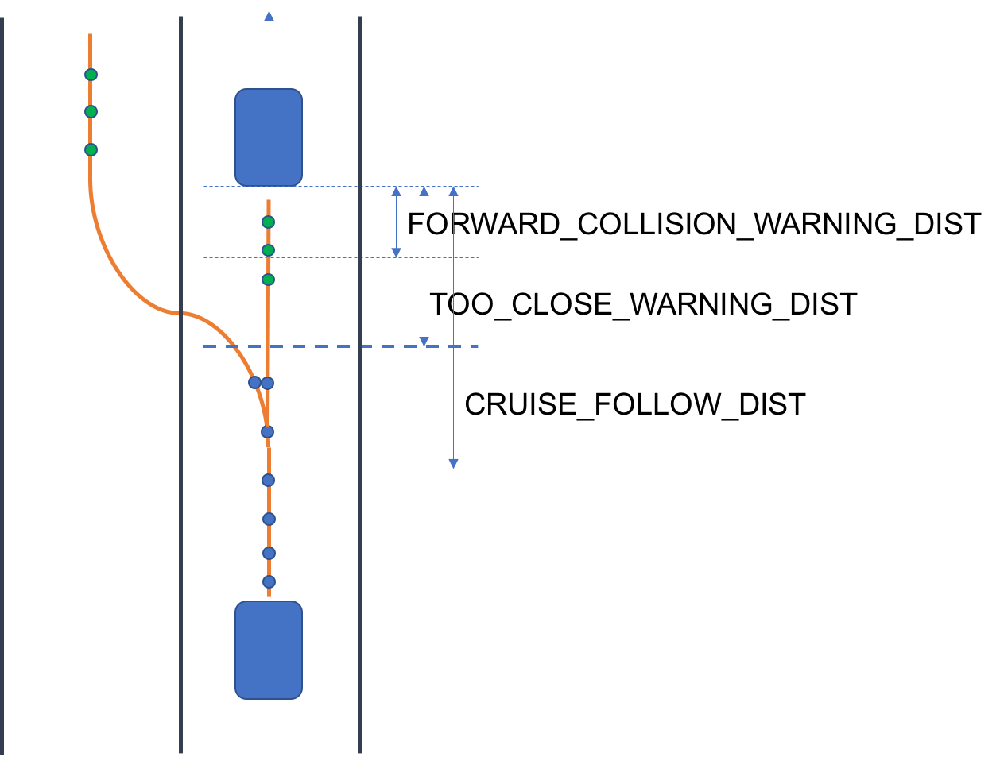

# CarND-Path-Planning-Project
Udacity CarND

### 1. About this repository
This repository contains a path planning module for virtual highway, with given localization and sensor fusion information.

### 2. About the Simulator.
Simulator can be downloaded from (https://github.com/udacity/self-driving-car-sim/releases).

### 3. Communication Protocol and Additional Constrains
#### 3.1 Map data
each line from map data file contains five terms.

* ["x"] the x coordinates of waypoint
* ["y"] the y coordinates of waypoint
* ["s"] s frenet coordinates of waypoint
* ["d_x"] the unit vector in x,y coordinates, which describe the direction of corresponding d from frenet coordinates
* ["d_y"] the same with d_x

one complete loop has 181 waypoints and 6945.554 meters along frenet coordinates. The width of lane is 4 meters. There are 3 lanes for each side. The waypoints are quite sparse.

#### 3.2 Ego Car Information from Simulator
For each 1-3 time tick from simulator, the path planning module will receive a update for ego car information and sensor fusion.

* ["x"] The car's x position in map coordinates [m]
* ["y"] The car's y position in map coordinates [m]
* ["s"] The car's s position in frenet coordinates [m]
* ["d"] The car's d position in frenet coordinates [m]
* ["yaw"] The car's yaw angle in the map, angle between 0 deg to car heading [deg]
* ["speed"] The car's speed [mph]

#### 3.3 Sensor Fusion from Simulator
e.g.
``` c++
auto sensor_fusion = j[1]["sensor_fusion"];
```
* ["id"] sensor_fusion[0], other car's id in sensor fusion
* ["x"] sensor_fusion[1], other car's x position in map coordinates [m]
* ["y"] sensor_fusion[2], other car's y position in map coordinates [m]
* ["vx"] sensor_fusion[3], velocity vector in map coordinates [m/s]
* ["vy"] sensor_fusion[4], velocity vector in map coordinates [m/s]
* ["s"] sensor_fusion[5], other car's s position in frenet coordinates [m]
* ["d"] sensor_fusion[6], other car's d position in frenet coordinates [m]

#### 3.4 Previous Path from Simulator
In update, the simulator will return unused path as previous_path variables to the planner.

previous_path = last_sent_planning_path - used_in_simulator_during_the_update.


#### 3.5 Output to Simulator
The algorithm will send a (x, y) coordinates list to simulator, e.g.
``` c++
json msgJson;
vector<double> next_x_vals;
vector<double> next_y_vals;
msgJson["next_x"] = next_x_vals;
msgJson["next_y"] = next_y_vals;
auto msg = "42[\"control\"," + msgJson.dump() + "]";
ws.send(msg.data(), msg.length(), uWS::OpCode::TEXT);
```
The simulator will move the ego car in next 1-3 time tick according to the coordinates' list. Note, the coordinates contains **NOT** only position information, but also kinematics information. For example, 3 coordinates contains velocity information, and 4 coordinates contains acceleration information. The default internal time tick from simulator is 0.02 [s]. It means the simulator will move the cars to next given coordinate every 0.02 seconds.

#### 3.6 Additional Constrains
max velocity is 50 [mph]. max acceleration is 10m/s^2. max jerk is 10m/s^3. estimated time for one loop is less than 6 minutes, if the ego can find the optimal paths.

### 4. Path Planner Solutions
There are two suggested solutions. One is to calculate a new trajectory during each update. The other one is to calculate the incremental path due to updated information. In this project, I used incremental solution, but both solutions will be discussed in this section.

#### 4.1 Solution I - Start-End states planning Model (not used in this project)
This solution was introduced by the lectures of CarND.

The concept can be concluded as following steps.
1. Use a finit state machine(FSM) to manage how to switching different behaviors, such as lane keeping, lane change and prepare lane change.
2. Explore feasible target kinematic status, e.g. as target = {s, v_s, a_s, d, v_d, a_d}, based on traffic status.
3. Calculate optimal s-t, d-t curves based on current/target kinematic status.
4. Generate different trajectories with corresponding s-t, d-t curves.
5. Evaluate trajectories with cost functions to find the optimal trajectory
6. Send the optimal trajectory to simulator as next path.

The implementation is similar with the concept, only with some additional notes.

1. determine the new planning duration *T*. It depends on how many path points will be taken from previous path, and how many new path points will be calculated.
2. predict surrounding vehicles based on new planning duration *T*.
3. calculate current kinematic status in frenet coordinates e.g. as current = *{s, v_s, a_s, d, v_d, a_d}*. Additionally, in order to get the right current kinematics, the map waypoints need to be interpolated.
4. determine the next feasible optimal kinematic status in frenet coordinates e.g. as target = *{s, v_s, a_s, d, v_d, a_d}*, based on the predicted surrounding vehicles.
5. calculate the s-t curve and d-t curve individual with jerk minimized trajectory(JMT) methods, by solving a linear system. The s-t, d-t curves are considered as the optimal path.
6. generate trajectories based s-t, d-t curves with dt = 0.02 [s]
7. Evaluate trajectories with cost function to find the best trajectory.
8. Send the best trajectory

#### 4.2 Solution II - Incremental Planning Model(used in this project)
This solution was inspired by Aaron's code from project guide. The main idea is increase feasible velocity iteratively instead of solving linear systems with Start-End states.


**Fig.1 incremental planning model**

The concept can be concluded as following steps.

a. Behavior Planning

Use a finit state machine(FSM) to manage how to switching different behaviors, such as lane keeping, and lane change. I didn't use "prepare lane change" in the project.

b. Determine Target Kinematics

Unlike solution I, here only *{s_feasible, v_feasible, v_target}* is necessary for generating trajectories. *s_feasible* is the distance between ego car and the nearest ahead car in target lane. *v_feasible* is the velocity, which used to calculate trajectory in current update. *v_target* is the upper bound of *v_feasible*. *v_target* is determined by traffic status. More specifically, if there is no leading car, *v_target = MAX_V*. When there is leading vehicle in target lane, if the distance of leading car is larger than *CRUISE_FOLLOW_DIST*, then the ego car is allowed to drive at maximum velocity. If the distance of leading car is between *CRUISE_FOLLOW_DIST* and *TOO_CLOSE_WARNING_DIST*, then *v_target* will set with same velocity of leading car as cruise mode. If the distance of leading car is between *FORWARD_COLLISION_WARNING_DIST* and *TOO_CLOSE_WARNING_DIST*, *v_target* will set smaller leading car's velocity as slightly break, in order to keep safe distance. If the distance of leading is smaller than *FORWARD_COLLISION_WARNING_DIST*, then reduce *v_target* as break, and give *v_feasible* direct deceleration signal.

In each update, firstly the *v_target* will be determined due to traffic status. Then if current *v_feasible* is smaller than *v_target*, *v_feasible* will be increased with considering maximum allowed jerk and acceleration, otherwise *v_feasible* will be decreased, iteratively in each planning update.

The new planning velocity *v_feasible* is always updated to get close to *v_target* by an incremental in each update, thus I called this solution as incremental planning.

c. Generate Trajectories

Firstly, the complete previous path will be trusted and used as a part of new path. Unless there is other car, which intervene previous path according to current sensor fusion information.

Secondly, producing three waypoints with *{s+30, d_target}*, *{s+60, d_target}*, *{s+90, d_target}* as helper waypoints. These three points will only help to generate a spline to guide the real trajectory.

Finally, calculating the new planning points based on *v_feasible* on the spline from the last position of previous path.

d. Using Cost Functions to Select Trajectories.
In this project, I used following mainly cost functions to select trajectory.

* lane change penalty
* not in middle lane penalty
* collision penalty
* lower *v_target* penalty

Since I didn't use random perturbation trajectories. Selecting trajectory is equivalence with switching states in FSM.

In this project, I choose incremental planning model, since I think this method is more similar to human behaviors. It give gas or break instructions directly to follow or bypass, based on traffic situation. However, in the beginning of each update/planning, we need to check if the previous path is safe to accept based on current sensor fusion information. While sometimes other vehicle can not be assumed to drive with constant velocity and do not change lane. Sometime there is wild cars, which often suddenly change lane. In this case, previous path will be discarded, and a total new path need be calculated. Personally, I think this incremental model is more robust than the Start-End state model, especially when map information or kinematic information are lack of high resolution or not reliable.

In my current implementation, the ego car can always drive safety in my test. I didn't set cost functions' weights for conservative driving, instead of aiming the average velocity, which is about 5'20'' per loop. Thus, sometimes the ego car need emergency break to evade some wild car, which will suddenly do a lane change and intervene current ego car's lane. In this case, the planning output could occasionally break the maximum allow jerk rules. Generally speaking, the ego car can drive over 20 miles without violating any rules, the average speed is 5'22'' per loop.

### 5. Future works
In this project, I didn't implement *"prepare lane change"* for this version. In the trajectory structure, I preserved a variable *v_intended*, which can be used to distinguish *"keep lane"* and *"prepare lane change"* in cost functions. I believe with additional *"prepare lane change"* state, the ego car can escape some trapped situation more easily. My current implementation used a local planning view. For example, it will only consider the neighbor lanes instead of considering all lanes. So in current implementation, the ego car could be trapped in left lane or right lane. In the future, it can be improved to considering all lanes, then find a global optimal trajectory.

### 6. Result
youtube video: https://www.youtube.com/watch?v=iEQ9IgMyPC8
